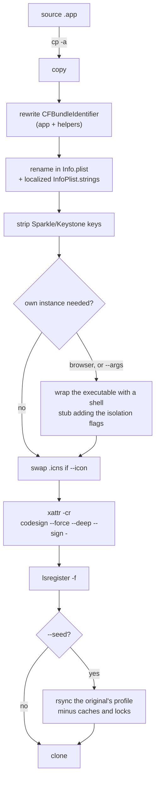

# clowner

Clone a macOS `.app` into a second, independent copy with its own bundle
identifier, so you can run two Braves, two Slacks, two of whatever.

macOS treats two copies with the same `CFBundleIdentifier` as the same app.
Change the identifier and the copy becomes a separate app. That breaks the code
signature, so clowner re-signs the clone ad-hoc.

## Install

```sh
curl -fsSL https://raw.githubusercontent.com/arisros/clowner/main/install.sh | sh
```

A single Bash script calling tools already on your Mac (`codesign`,
`PlistBuddy`, `sips`, `rsync`). Needs the Xcode command line tools.
[`fzf`](https://github.com/junegunn/fzf) is optional and gives fuzzy pickers.

## Use

```sh
clowner                 # wizard: pick app, name, profile, seed, icon
clowner list            # apps clowner can see, with their type
clowner clone --src "/Applications/Brave Browser.app" --name me_bravo --seed --icon ~/bravo.png --yes
```

| Flag | |
|---|---|
| `--src <path>` | source `.app` |
| `--name <name>` | clone name, without `.app` |
| `--id <bundle-id>` | identifier (default: the name) |
| `--dest <path>` | where to write it (default: `/Applications/<name>.app`) |
| `--profile <path>` | isolation directory (default: `~/Library/Application Support/Clowner/<name>`) |
| `--args "<flags>"` | launch flags for apps that refuse to run twice |
| `--no-profile` | clone bare, share the original's data |
| `--seed` | start the profile from a copy of the original's data |
| `--seed-from <dir>` | seed from this directory instead |
| `--icon <file>` | `.icns`, or any square image (1024x1024 ideal) |
| `--keep-updater` | keep Sparkle/Keystone keys |
| `--force` `--yes` | overwrite destination, skip the prompt |

## How it works



Seeding runs after signing on purpose: a multi-GB copy would otherwise leave a
broken-signature bundle in `/Applications` for minutes, and endpoint security
deletes that.

## Browsers, and everything else

Copy, re-identify, re-sign works on any `.app`. Browsers need one extra thing, a
flag so the second copy opens its own window instead of handing off to the
running one. Chromium gets `--user-data-dir`, Firefox gets `-no-remote
--profile`, both detected automatically. Anything else with a single-instance
lock takes `--args "--its-own-flag=..."`. Ordinary apps clone bare with
`--no-profile`.

## Seeding

`--seed` starts the clone from a copy of the original's profile: history,
logins, extensions, config. clowner finds the source itself (Chromium from
`CrProductDirName`, Firefox from `profiles.ini`) or takes `--seed-from`.

- Quit the original first, its databases are copied file by file.
- Expect the clone's profile to be about the size of the original's.
- First launch asks for keychain access. Click **Always Allow** or the seeded
  passwords and cookies reset.
- It is a snapshot, not a sync. The two profiles drift from then on.

## Icons

`--icon` takes a `.icns` as-is and converts anything else to a multi-resolution
`.icns`. The wizard lists images from `~/Desktop`, `~/Downloads`, `~/Pictures`
and the current folder, or you type a path. Modern apps load their icon from
`Assets.car` via `CFBundleIconName`; clowner drops that key so the `.icns` wins.
If macOS still shows the old icon, `killall Dock Finder`.

## Limitations

- **macOS only.** Built on `.app` bundles, `Info.plist` and `codesign`.
- **No App Store or `/System` apps** (Safari, Mail, ...). Their signatures are
  not reproducible ad-hoc and the copies refuse to launch.
- **No auto-update.** Re-run clowner after the original updates.
- **Ad-hoc signature.** `codesign` verifies, `spctl` rejects. Only matters to
  tooling that gates on Gatekeeper.
- **First launch prompts for the keychain.** The clone is a new signing
  identity. Entitlements are dropped on purpose, keeping them makes the clone
  exit immediately at launch.
- **Policy keyed on the original bundle id does not apply** to the clone: MDM
  rules, DLP, network filters. Check before relying on a clone at work.
- **Apps that hardcode their id for licensing** may deactivate in the clone.
- **`--no-profile` shares the original's data and lock,** so a single-instance
  app cannot run both copies at once.
